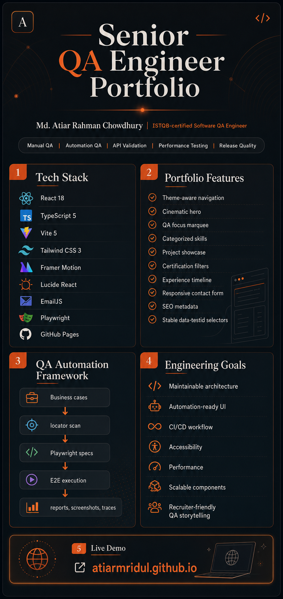

# Senior QA Engineer Portfolio




A premium portfolio and QA engineering showcase for Md. Atiar Rahman Chowdhury, an ISTQB-certified
Software QA Engineer focused on manual testing, automation testing, API validation, performance testing,
and release quality workflows.

## Live Demo

https://atiarmridul.github.io/

## About This Project

This repository showcases:

- Senior-level QA engineering portfolio presentation
- Manual and automation testing expertise
- Production-style React, TypeScript, and Tailwind implementation
- Responsive, recruiter-friendly UI with smooth interactions
- AI-assisted Playwright QA automation framework
- GitHub Pages deployment workflow

## Tech Stack

- React 18
- Vite 5
- TypeScript 5
- Tailwind CSS 3
- Framer Motion
- Lucide React
- EmailJS
- Playwright
- GitHub Pages

## Features

- Editorial-tech QA engineer portfolio design with custom cursor and reveal interactions
- Theme-aware sticky navigation with desktop/mobile menus and persisted light/dark mode
- Cinematic hero section with QA positioning, primary CTAs, and scroll affordance
- Horizontal marquee section for QA focus areas
- Categorized skills with applied proficiency indicators
- Project showcase cards with architecture preview modal
- Filterable certification and learning milestone cards
- Professional experience timeline
- Responsive contact form with EmailJS integration
- SEO metadata for the QA engineer portfolio
- Stable `data-testid` selectors for automation

## Engineering Goals

- Clean and maintainable architecture
- Automation-ready frontend
- CI/CD integration
- Accessibility improvements
- Performance optimization
- Scalable component structure
- Recruiter-friendly storytelling for QA engineering impact

## Documentation

Project documentation is available inside the `docs/` folder.

- [Documentation Index](docs/README.md)
- [Architecture](docs/architecture.md)
- [Testing Strategy](docs/testing-strategy.md)
- [Deployment Process](docs/deployment-process.md)
- [Coding Guidelines](docs/coding-guidelines.md)
- [Project Structure](docs/project-structure.md)

## Project Structure

```txt
atiarmridul.github.io/
├── public/                     # Static public assets
│   └── assets/readme-infographic.png
├── src/
│   ├── components/             # Reusable UI components
│   │   ├── Header.tsx          # Theme-aware sticky navigation
│   │   ├── Hero.tsx            # Editorial QA hero
│   │   ├── Marquee.tsx         # Horizontal QA focus strip
│   │   ├── About.tsx           # Professional summary and QA values
│   │   ├── Skills.tsx          # Capability matrix and tools
│   │   ├── Projects.tsx        # Automation projects and modal previews
│   │   ├── Achievements.tsx    # Certifications and learning milestones
│   │   ├── Domains.tsx         # Industry/domain expertise
│   │   ├── Experience.tsx      # Professional timeline
│   │   ├── Education.tsx       # Academic background
│   │   ├── Contact.tsx         # Contact form and social links
│   │   └── Footer.tsx          # Compact site credit footer
│   ├── constants.ts            # Navigation data
│   ├── App.tsx                 # Main application structure
│   ├── main.tsx                # React application entry point
│   ├── index.css               # Global tokens, Tailwind layers, and interaction utilities
│   └── utils/                  # Scroll, theme, and DOM interaction helpers
│
├── qa-engine/                  # AI-assisted QA automation framework
├── docs/                       # Portfolio and QA framework documentation
├── CODING_STANDARDS.md         # Engineering and coding conventions
├── package.json                # Project dependencies and scripts
├── tailwind.config.js          # Tailwind CSS configuration
├── tsconfig.json               # TypeScript configuration
├── vite.config.ts              # Vite configuration
└── README.md                   # Project documentation
```

## Getting Started

### Install

```bash
git clone https://github.com/atiarmridul/atiarmridul.github.io.git
cd atiarmridul.github.io
npm install
```

### Run Development Server

```bash
npm run dev
```

### Build Project

```bash
npm run build
```

### Run Lint

```bash
npm run lint
```

### Run Quality Checks

```bash
npm run quality
npm run build
```

## Contact Form Setup

The contact form uses EmailJS from the browser. Copy the example env file into a local Vite env file:

```bash
cp .env.example .env.local
```

Then set the frontend-safe values:

```env
VITE_EMAILJS_SERVICE_ID=service_btdlks9
VITE_EMAILJS_TEMPLATE_ID=template_6g4f9jq
VITE_EMAILJS_PUBLIC_KEY=your_emailjs_public_key
```

Use the EmailJS **Public Key** only. Do not put the EmailJS private key in this React app, `.env.local`, or any
committed file. Vite reads env variables when the dev server starts, so restart `npm run dev` after changing
`.env.local`.

The EmailJS template should expose these variables:

```text
{{name}}
{{email}}
{{subject}}
{{message}}
{{time}}
```

## AI QA Automation Framework

This repository includes a modular AI-assisted QA layer that converts business test cases into executable Playwright + TypeScript specs.

### QA Structure

```ini
qa-engine/
├── ai/                       # Definitions, generated definitions, locator catalog, prompts
├── bin/                      # CLI entry points
├── core/                     # Parser, generator, locator engine, assertions, reporting
├── playwright/               # Fixtures, page objects, generated specs, runtime config, test data
├── input/                    # Raw JSON/XLSX imports
└── output/                   # Reports, screenshots, traces, and local artifacts
```

### Workflow

1. Add business cases to `qa-engine/ai/definitions/business-test-cases.json` or an `.xlsx` file with these columns:

```text
Module | Scenario | Step | Expected Result | Priority | Tags
```

2. Generate the sample Excel input when needed:

```sh
npm run qa:sample-excel
```

3. Start or reuse the Vite app:

```sh
npm run dev
```

4. Scan the live website and build the locator catalog:

```sh
npm run qa:scan
```

5. Generate Playwright specs from business cases:

```sh
npm run qa:generate
```

6. Run the generated tests:

```sh
npm run test:e2e
```

After UI markup changes, review and regenerate the locator catalog and generated specs before treating
Playwright failures as product regressions. The generated files are intentionally reviewable, but they may lag
behind the latest React components until `qa:scan` and `qa:generate` are run.

### Output

- Structured AI-readable definitions in `qa-engine/ai/generated-tests/structured-test-definitions.json`
- Centralized locators in `qa-engine/ai/locator-catalog/locators.json`
- Human-readable Playwright specs in `qa-engine/playwright/tests/generated/`
- Reusable generated test data in `qa-engine/playwright/test-data/generated-test-data.json`
- Test metadata comments including priority, module, tags, risk level, timestamp, and confidence score
- Runtime self-healing selectors with fallback order: `data-testid`, `aria-label`, role, placeholder/text, CSS, XPath
- `data-testid` is also retained as a fallback candidate so repaired locators can still recover through the stable test ID.

### Extending With An LLM

The implementation uses deterministic heuristics so it can run locally and in CI. To add an LLM, plug it into `qa-engine/core/generator/generate-test.ts` after `parseBusinessTestCases()` and before `renderSpec()` to enrich actions, assertions, tags, or locator matching. Keep generated JSON and specs reviewable before execution.

### CI Notes

`playwright.config.ts` enables retries in CI, screenshots, videos, and trace retention on failure. Set `PLAYWRIGHT_BASE_URL` to test a deployed environment, or keep the default web server to test the local Vite app.

## Deployment (GitHub Pages)

Hosted using GitHub Pages.

```bash
npm run deploy
```

## QA Automation Vision

This repository is designed as a professional QA engineering showcase featuring:

- UI automation
- Cross-browser validation
- Responsive testing
- Accessibility validation
- CI pipeline integration
- Automated deployment workflows

## Author

Md. Atiar Rahman Chowdhury

- Senior Software QA Engineer
- ISTQB Certified Tester - Foundation Level 4.0

## Links

- LinkedIn: https://www.linkedin.com/in/atiarmridul/
- GitHub: https://github.com/atiarmridul
